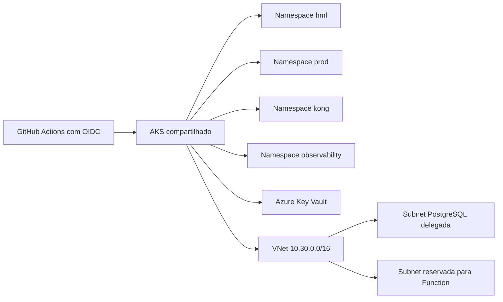

# soat-aks-infra

Infraestrutura Azure Kubernetes Service da plataforma SOAT. Este repositório
provisiona a rede compartilhada, AKS, Key Vault, identities federadas e a base
Kubernetes para homologação e produção.

## Arquitetura



O diagrama central e as decisões arquiteturais estão em
[soat-api/docs/architecture](https://github.com/JoaoGW/soat-api/tree/main/docs/architecture).

## Stacks

- `foundation`: VNet, subnets, DNS privado PostgreSQL, Key Vault, AKS,
  Workload Identity, Secrets Store CSI e identities OIDC para infraestrutura,
  Function e pipeline da API.
- `environments/hml`: namespace `hml`, namespaces compartilhados `kong` e
  `observability`, além do Kong sem rotas de negócio.
- `environments/prod`: namespace `prod` no mesmo cluster.

O AKS usa Azure CNI Overlay, Azure RBAC, OIDC, Secrets Store CSI e
autoscaling de um a dois nós. O Deployment, HPA e PDB da API estão em
`soat-api/deploy`; Prometheus/Grafana pertencem à Fase 6.

As identities `api_hml` e `api_prod` autenticam o workflow da API por OIDC e
recebem os papéis Azure Kubernetes Service Cluster User e Azure Kubernetes
Service RBAC Cluster Admin somente no cluster. O primeiro permite obter a
credencial do cluster; o segundo autoriza a operação Kubernetes. As identities
de workload `api_workload[hml|prod]` são federadas aos
ServiceAccounts de mesmo ambiente e podem apenas ler segredos do Key Vault.
Os client IDs necessários estão no output não sigiloso
`github_identity_client_ids` e os de workload em `api_workload_client_ids`.

## Pré-requisitos e bootstrap

- Azure CLI autenticado na assinatura Free Account correta;
- Terraform 1.9.8, kubelogin, TFLint e Trivy;
- grupos `rg-soat-platform`, `rg-soat-data` e `rg-soat-auth`, além da Storage
  Account privada de state criados na Fase 0;
- SKU `Standard_B2s`, quota e crédito validados em Brazil South.

O primeiro `apply` da `foundation` é feito localmente com login interativo para
criar as identities OIDC que quebram o ciclo inicial do CI. Copie os arquivos
`*.example` para arquivos locais ignorados, preencha os nomes reais do state e
execute apenas após validar o custo:

```bash
terraform -chdir=foundation init -backend-config=.backend.hcl
terraform -chdir=foundation plan -out=foundation.tfplan
terraform -chdir=foundation apply foundation.tfplan
```

Não há fallback automático de SKU e não existe `apply` permitido enquanto a
estimativa e o crédito não forem revisados.

## CI/CD e variáveis

PRs executam formatação, validação, TFLint, Trivy e plano somente leitura
quando o bootstrap OIDC estiver concluído. `development` promove `hml` e
`main` promove `prod`; ambos só aplicam quando a variável do Environment
`TF_APPLY_ENABLED` for `true`.

As variáveis não sigilosas necessárias são `AZURE_TENANT_ID`,
`AZURE_SUBSCRIPTION_ID`, `AZURE_CLIENT_ID`, `AZURE_CLIENT_ID_PLAN`,
`TF_STATE_RESOURCE_GROUP`, `TF_STATE_STORAGE_ACCOUNT`,
`TF_STATE_AKS_CONTAINER` e `RESOURCE_NAME_SUFFIX`. Nenhuma senha ou client
secret é aceita pelo pipeline.

O workflow de destroy exige a palavra `DESTRUIR` e
`TF_DESTROY_ENABLED=true`. Use-o após registrar as evidências da entrega.

## Validação local

```bash
terraform fmt -check -recursive
for stack in foundation environments/hml environments/prod; do
  terraform -chdir="$stack" init -backend=false -input=false
  terraform -chdir="$stack" validate
done
tflint --recursive
trivy config --ignorefile .trivyignore --severity CRITICAL .
```

Este repositório não possui Dockerfile: entrega infraestrutura como código,
não uma aplicação executável.
